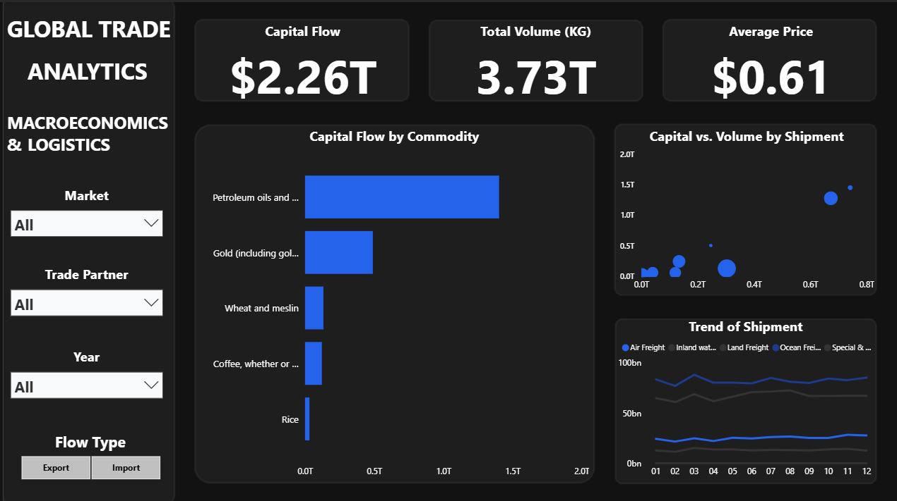

# 🌐 Global Trade Intelligence: Zero-Disk ELT & Machine Learning Pipeline

## 📌 Executive Summary
This repository houses an end-to-end, entirely in-memory data engineering and machine learning architecture. The pipeline processes over 1.2 million global trade records from the UN Comtrade database, capturing a **six-year macroeconomic timeframe (2018–2023)** across key international trade partners, including **Ghana, Germany, and Canada**. 

Designed around a strict "zero-disk" philosophy, the architecture leverages DuckDB and dbt for upstream transformations, conducts rigorous algorithmic showdowns across three machine learning domains, and serves macroeconomic insights via a high-performance business intelligence dashboard. 

## 🏗️ Architecture & Data Engineering
To ensure maximum performance and minimal infrastructure overhead, data was processed entirely in-memory without relying on local disk storage. 

*   **Zero-Disk Ingestion (ELT):** Extracted 1.2M rows of raw trade data directly into memory, serializing the output into compressed `.parquet` files hosted in a private Hugging Face cloud bucket.
*   **Upstream Exploration (DuckDB):** Utilized DuckDB to execute high-speed, in-memory skeleton queries on the raw Parquet data, establishing clean testing logic prior to formal modeling. 
*   **Medallion Architecture (dbt):** Ported validated DuckDB queries into `dbt` to generate four distinct, purpose-built analytical views:
    1.  *Regression View* (Pricing modeling)
    2.  *Clustering View* (Trade corridor grouping)
    3.  *Time-Series View* (Macro forecasting)
    4.  *Dashboard View* (Business Intelligence)
*   All materialized views were streamed back to the Hugging Face cloud as lightweight `.parquet` assets.

## 🤖 Machine Learning: Algorithmic Showdowns
Instead of blindly applying algorithms, the predictive layer was built using rigorous cross-validation and challenger testing. The champion models were serialized into `.joblib` files and pushed directly to the cloud via `io.BytesIO()` memory buffers.

*   **Pricing Regression:** Evaluated a standard Linear Regression baseline against Ridge, Random Forest, and XGBoost challengers to predict trade value.
*   **Corridor Clustering:** Tested K-Means against Agglomerative Clustering, Gaussian Mixture Models (GMM), and HDBSCAN to isolate distinct macroeconomic trade routes. 
*   **Time-Series Forecasting:** Benchmarked classical SARIMAX against additive and tree-based challengers (Prophet, XGBoost, LightGBM) to forecast future trade volumes.

## 📊 Business Intelligence & Macro-Trade Insights
The frontend `Dashboard View` was routed through MotherDuck to power an interactive dashboard. The UI prioritizes a high data-to-ink ratio, stripping away redundant visuals to focus strictly on the data geometry and economic storytelling. 

**Key Analytical Findings:**
*   **Extreme Capital Concentration:** Spanning all selected countries over the entire six-year period (2018–2023), the unfiltered global market reveals a massive skew toward energy and precious metals. Out of the $2.26T total capital flow, Petroleum Oils and Gold completely dwarf agricultural commodities like Wheat, Coffee, and Rice. This highlights a global trade landscape anchored heavily by industrial and wealth dependencies rather than food staples.
*   **Logistical Polarization:** The Capital vs. Volume scatter plot demonstrates that global shipping is not evenly distributed. Sea transport (the top-right outlier) controls a disproportionate share of both the 3.73T KG volume and capital flow. Conversely, Air freight registers as the largest bubble touching the X-axis, indicating an unparalleled price-per-volume premium despite moving significantly less physical weight. Lower-tier logistics channels (rail, road, postal) remain tightly clustered near the baseline.
*   **Structural Rigidity in Freight Expenditures:** Despite potential global market volatility between 2018 and 2023, the 12-month Trend of Shipment lines are remarkably flat. The parallel stability across both top-tier (Air) and lower-tier (Ocean) freight spending suggests that global logistics operate largely on rigid, long-term contracts rather than volatile, month-to-month spot market pricing.

## 🚀 Phase 2: Future Roadmap
While the core ELT, machine learning, and BI pipelines are successfully deployed, the architecture is designed to scale. Upcoming feature integrations include:
*   **Predictive Web UI:** Deploying a dynamic Streamlit front-end directly connected to the `.joblib` models hosted on the Hugging Face Hub. 
*   **Containerization:** Wrapping the inference environments in Docker for platform-agnostic deployment.
*   **Continuous Integration (CI/CD): Implementing GitHub Actions to automate Python linting and testing workflow upon new code commits.
*   **Enterprise Scaling:** Transitioning the storage and compute layer to AWS, Databricks and Snowflake to optimize for automated, continuous data ingestion and ATS system alignment.